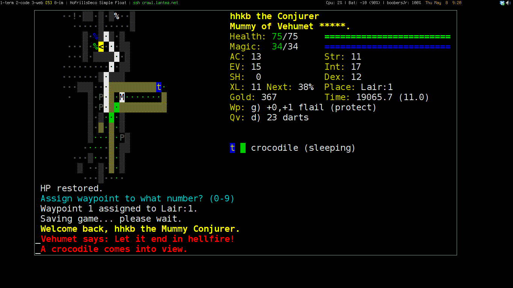

# Crawl starter kit

[crawl](http://crawl.develz.org) defaults are generally pretty good.
This kit contains my personal tweaks which you may find helpful.

# rc file

The `init.txt` file is the rc file that you can use locally (by
copying it into your `~/.crawl` directory), or copy/pasting into
your online settings.

Suggested use is to tweak your personal settings at the end of the
file to override the defaults.

## Features

* MarvinPA.rc import
    * Saner spell shortcuts
    * More consistent console glyphs (somewhat obsolete with 0.15 changes)
    * Improved autopickup
    * Saner defaults
    * Remove some UI annoyances
* Various alerts that are useful for the new player
    * HugeDmg - informs you when you take a lot of damage
    * Banish - informs you when a mob that can cast banish is in sight
    * Paralyze/Airstrike - same as above

# Nice term fonts/colours

crawlterm is a bash script which starts up a terminal for playing
console crawl. Requires rxvt-unicode and DejaVu fonts.

# irssi #crawl bot parser

The best source for information are the crawl bots, located at
`#crawl` on `irc.freenode.net`.

[crawl-botmsg.pl]( http://voyager.lupomesky.cz/crawl/irssi-colorizer/)
is an irssi plugin to add color highlighting and formatting to the
crawl bots. With some minor changes to prevent it crashing irssi on
buffer playback.
